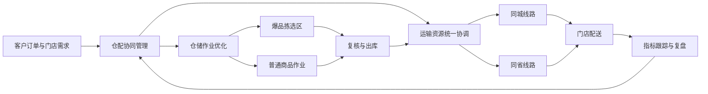
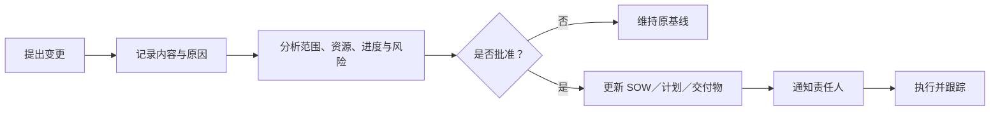

# SOW 模板样例：便利店 BC 仓配一体化优化项目

> 文档类型：Statement of Work，工作说明书
> 文档用途：售前方案和项目交付能力展示
> 项目属性：基于真实经历抽象的脱敏模拟样例
> 特别说明：本文件不是实际合同或企业原始文件，不包含报价、客户全称、仓库地址和内部系统信息

## 1. 文档信息

| 项目 | 内容 |
|---|---|
| 项目名称 | L 客便利店 BC 仓配一体化优化项目 |
| 客户名称 | L 客，已脱敏 |
| 服务方 | 某物流服务方 |
| 文档版本 | V1.0 |
| 文档状态 | 作品集样例 |
| 保密级别 | 公开脱敏版 |
| 生效方式 | 以双方正式合同及签署版本为准 |

## 2. 项目背景

L 客经营连锁便利店业务，存在仓内高频商品拣选效率、仓储与运输协同、承运资源统一管理、同城同省线路组织及订单缺货等方面的改善需求。

本项目拟通过仓储作业优化、运输资源统筹和线路整合，建立 BC 仓配一体化协同机制。

## 3. 项目目标

### 3.1 业务目标

- 提升仓内订单处理能力；
- 改善高频商品拣选效率；
- 降低订单缺货率；
- 提升日出库 GMV 承接能力；
- 提升仓储、运输和承运商之间的协同效率；
- 沉淀可复用于相近便利店业务的方案框架。

### 3.2 参考业务指标

| 指标 | 基线 | 参考结果 |
|---|---:|---:|
| 日出库 GMV | 60 万元 | 90 万元以上 |
| 拣货效率 | 项目基线 | 提升 11% |
| 订单缺货率 | 53% | 降至 7% |

> 上述业务指标受订单、库存、商品供应、客户运营和资源投入等多因素共同影响。除非正式合同另有约定，不应将其作为由服务方单独保证的无条件验收承诺。

## 4. 工作范围

### 4.1 范围内工作

#### A. 业务调研与现状诊断

- 梳理客户订单、商品和流向的基本特征；
- 梳理仓储、运输和承运商协同现状；
- 识别爆品拣选、缺货和线路组织问题；
- 确认指标口径和项目基线；
- 形成问题清单和需求确认记录。

#### B. 仓储作业优化

- 分析高频商品拣选场景；
- 设计爆品拣选区改造思路；
- 明确爆品区与补货、复核、出库环节的衔接；
- 形成分阶段实施建议；
- 跟踪实施后的拣选效率变化。

#### C. 运输资源协同

- 梳理现有运输及承运资源；
- 建立仓储出库计划与运输准备的协同方式；
- 明确承运商协作边界；
- 形成异常情况的沟通与处理机制。

#### D. 同城同省线路整合

- 梳理订单流向和现有线路；
- 识别具备整合条件的线路；
- 在满足履约要求的前提下形成线路整合建议；
- 配合相关团队推进方案执行；
- 跟踪线路运行情况。

#### E. 指标跟踪与复盘

- 建立项目指标清单；
- 记录基线、实施动作和阶段结果；
- 分析业务结果与方案动作之间的关系；
- 形成项目复盘和复制建议。

### 4.2 范围外工作

除非通过正式变更流程另行约定，以下事项不在本 SOW 范围内：

- 客户现有信息系统的整体替换；
- 新建仓库的土建工程；
- 未在正式合同中约定的自动化设备采购；
- 承运商采购合同的法律谈判；
- 客户商品采购和供应商管理；
- 客户经营策略、价格和促销决策；
- 未提供数据条件下的收益保证；
- 未经确认的新增区域、仓库或业务类型；
- 任何违反数据安全、商业保密或合规要求的工作。

## 5. 总体方案

## 6. 交付物

| 编号 | 交付物 | 主要内容 | 交付形式 | 验收方式 |
|---|---|---|---|---|
| D-01 | 现状与需求分析 | 业务背景、问题、需求和约束 | Markdown／文档 | 双方评审确认 |
| D-02 | 仓配一体化方案 | 仓储、运输、承运和线路方案 | Markdown／文档 | 方案评审 |
| D-03 | 爆品区改造建议 | 商品识别、区域和实施建议 | 文档／示意图 | 仓储团队确认 |
| D-04 | 线路整合建议 | 流向、线路和资源协同思路 | 文档／表格 | 运输团队确认 |
| D-05 | 实施任务清单 | 任务、责任人、依赖和状态 | 表格 | 项目例会核对 |
| D-06 | 指标跟踪表 | 指标口径、基线和阶段结果 | 表格 | 数据口径检查 |
| D-07 | 项目复盘报告 | 结果、问题、风险和复制建议 | Markdown／文档 | 项目复盘会确认 |

## 7. 项目阶段与里程碑

| 里程碑 | 阶段目标 | 关键输出 | 完成条件 |
|---|---|---|---|
| M1 项目启动 | 明确范围和协作机制 | 启动纪要、联系人清单 | 双方确认 |
| M2 需求基线 | 完成现状与问题梳理 | 需求分析、指标口径 | 评审通过 |
| M3 方案确认 | 完成仓储和运输方案 | 总体方案、实施清单 | 方案确认 |
| M4 实施验证 | 推进改造与线路整合 | 执行记录、问题清单 | 关键动作完成 |
| M5 项目复盘 | 汇总结果和经验 | 指标表、复盘报告 | 复盘确认 |

> 各阶段具体起止日期以正式项目计划为准。

## 8. 双方职责

### 8.1 客户职责

- 提供真实、合法且可用于本项目的数据和材料；
- 指定业务、仓储、运输等对接人；
- 确认业务目标、指标口径和约束；
- 组织内部资源参与评审和实施；
- 对客户负责的库存、商品供应和经营动作负责；
- 按约定时间反馈方案和交付物。

### 8.2 服务方职责

- 组织需求调研和问题分析；
- 输出仓配一体化解决方案；
- 协调服务方仓储、运输及相关资源；
- 支持爆品拣选区和线路整合方案推进；
- 跟踪项目任务、问题和指标；
- 输出约定的交付材料；
- 保护客户数据和商业信息。

## 9. RACI 职责矩阵

> R：执行；A：最终负责；C：协商；I：知会。

| 工作项 | 客户业务团队 | 服务方方案团队 | 仓储团队 | 运输团队／承运商 |
|---|---|---|---|---|
| 业务目标确认 | A | R | C | C |
| 现状调研 | C | A/R | C | C |
| 爆品区方案 | C | C | A/R | I |
| 运输资源协调 | I | C | C | A/R |
| 线路整合 | C | C | I | A/R |
| 指标口径确认 | A | R | C | C |
| 项目复盘 | A | R | C | C |

## 10. 验收标准

### 10.1 文档与方案验收

- 交付物与清单一致，版本可识别；
- 使用双方确认的数据口径；
- 已知事实、假设和待确认项表达清楚；
- 方案覆盖已确认需求并说明责任边界；
- 实施任务、依赖和风险明确；
- 不包含未授权的敏感信息或未经确认的承诺。

### 10.2 业务指标验证

- 基线和结果采用一致口径；
- 数据时间范围明确；
- 重大业务变化得到记录；
- 客户负责事项已按约定执行；
- 结果由双方共同核验。

## 11. 前提假设与依赖

- 客户按约定提供必要数据；
- 各专业团队能够参与方案评审和实施；
- 仓储业务在改造期间保持基本连续；
- 承运资源具备方案执行条件；
- 线路调整符合客户履约要求；
- 项目范围未发生未经评估的重大变化；
- 所有数据使用符合授权和安全要求。

若前提条件不成立，双方应评估对范围、计划和结果的影响。

## 12. 变更管理

变更单至少包含变更描述、提出方、原因、影响分析、交付物变化、责任人和生效方式。

## 13. 风险管理

| 风险 | 影响 | 预防措施 | 触发后的处理 |
|---|---|---|---|
| 数据口径不一致 | 指标无法比较 | 启动阶段确认口径 | 重新核验基线 |
| 改造影响正常出库 | 业务波动 | 分阶段实施 | 暂停并恢复稳定方案 |
| 商品结构变化 | 爆品区效果下降 | 定期复核爆品 | 调整商品范围 |
| 运力不足 | 线路方案无法执行 | 提前确认资源 | 启动替代资源协调 |
| 跨团队协同延迟 | 里程碑延期 | 明确责任人与例会机制 | 升级问题并调整计划 |
| 范围持续扩大 | 项目失控 | 执行变更流程 | 重新确认范围 |

## 14. 沟通、数据安全与保密

- 通过启动会、项目例会、专题评审、异常沟通和复盘会推进项目；
- 会议结论记录决策、责任人和待办事项；
- 仅使用项目所需且获得授权的数据；
- 不在未授权工具中存储客户数据；
- 对客户名称、价格、地址和账号等信息进行保护；
- 对外材料必须脱敏；
- 项目结束后按约定归档或处置数据。

## 15. 项目关闭

满足以下条件后进入项目关闭：

- 约定交付物已完成；
- 评审意见已处理；
- 关键任务和问题状态已确认；
- 指标结果完成核验或说明；
- 项目资料已归档；
- 后续运营或支持责任已移交。

## 16. 签署栏模板

| 角色 | 姓名 | 日期 | 意见／签字 |
|---|---|---|---|
| 客户项目负责人 |  |  |  |
| 服务方项目负责人 |  |  |  |
| 仓储负责人 |  |  |  |
| 运输负责人 |  |  |  |
