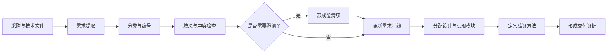
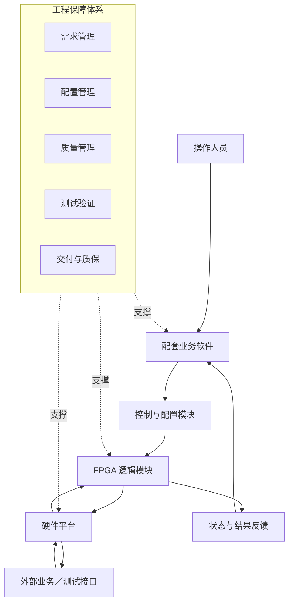
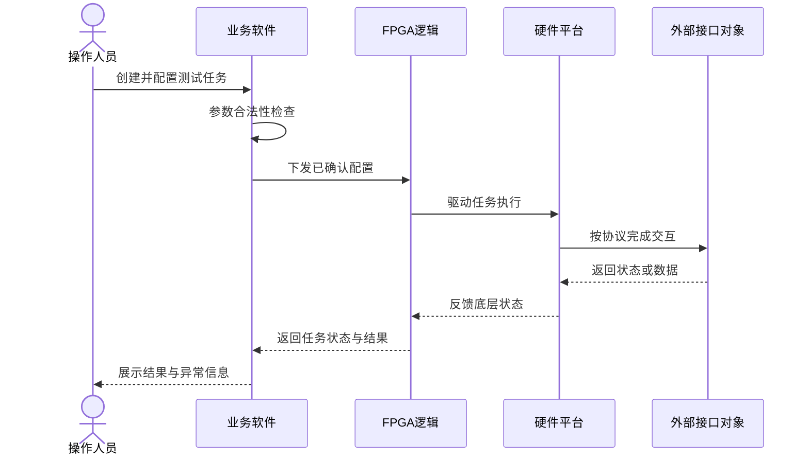
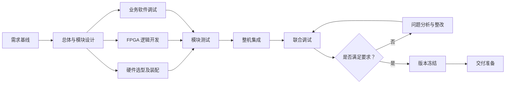
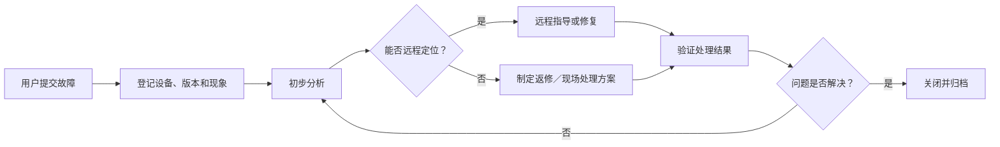

# 军工项目招投标技术方案片段样例

> 项目名称：某业务模拟测试分系统
> 文档类型：投标技术方案片段
> 文档属性：基于项目经历抽象的脱敏模拟材料
> 保密说明：不包含采购方全称、装备型号、指标数值、接口参数、部署地点和测试数据
> 使用说明：所有标记为“按技术协议”的内容应在正式投标时替换为经确认的信息

## 1. 项目理解

### 1.1 建设背景

本项目拟建设一套业务模拟测试分系统，用于完成采购文件规定的业务模拟、控制配置、数据交互和测试验证任务。

系统研制范围涉及硬件平台选型与整机装配、FPGA 逻辑设计与 bit 固件生成、配套业务软件调试、模块接口适配、整机联合调试、交付资料编制、现场交付及质保期服务。

### 1.2 建设目标

1. 满足招标文件、采购合同和技术协议规定的功能要求；
2. 满足技术协议规定的性能指标和接口要求；
3. 实现硬件、FPGA 固件和业务软件的协同运行；
4. 建立从需求到设计、实现、测试和交付的追踪关系；
5. 提供完整的设备、固件和技术文档；
6. 形成覆盖 48 个月的质保服务机制。

### 1.3 项目理解原则

- **需求可追踪：** 每项招标要求均对应设计响应和验证方式；
- **指标可验证：** 技术指标在方案阶段明确验证方法；
- **接口可控制：** 对输入、输出、时序和异常进行统一管理；
- **版本可识别：** 硬件、固件、软件和文档版本保持一致；
- **交付可核验：** 实物、固件和资料按清单交付；
- **风险可闭环：** 对需求、外协、联调和交付风险提前管理。

## 2. 需求响应与追踪

### 2.1 需求分析方法

### 2.2 需求响应矩阵样例

| 需求编号 | 需求来源 | 需求摘要 | 技术响应 | 验证方式 | 交付证据 |
|---|---|---|---|---|---|
| REQ-F-001 | 招标文件 | 完成规定的业务模拟功能 | 由 FPGA 逻辑、硬件平台及业务软件协同实现 | 功能测试／演示 | 测试记录 |
| REQ-P-001 | 技术协议 | 满足规定性能指标 | 按协议指标进行设计与验证 | 指标测试 | 指标测试结果 |
| REQ-I-001 | 技术协议 | 满足外部接口要求 | 通过接口适配模块实现 | 接口联调 | 联调记录 |
| REQ-D-001 | 采购合同 | 提供完整随货资料 | 按交付清单编制并核对 | 文档检查 | 文档签收记录 |
| REQ-S-001 | 采购合同 | 提供质保服务 | 编制 48 个月质保方案 | 方案审查 | 质保文件 |

> 正式项目中的需求描述、编号和指标应以采购文件为准。

## 3. 总体技术方案

### 3.1 设计原则

- **模块化：** 将系统划分为硬件、FPGA、业务软件、接口适配和测试保障模块；
- **任务驱动：** 围绕用户测试任务组织配置、执行、状态反馈和结果检查；
- **接口明确：** 使用定义清晰的输入、输出和状态协同；
- **可测试：** 每项要求均具备可执行的验证方式和判定依据；
- **可交付：** 同步考虑设备、固件、软件、技术资料和质保服务。

### 3.2 系统架构

### 3.3 业务流程

> 该流程为公开抽象，不表示真实系统通信协议或接口时序。

## 4. 分系统设计

### 4.1 硬件平台

硬件平台承担系统运行、逻辑承载和外部接口连接等任务。选型和设计应考虑技术协议符合性、FPGA 适配性、软件协同、接口兼容性、装配维护条件、采购替代风险及质保要求。具体型号和参数以正式选型文件为准。

### 4.2 FPGA 逻辑与固件

主要工作包括逻辑需求分解、模块接口定义、逻辑开发、仿真验证、bit 固件生成、硬件烧录联调、版本标识及固件交付归档。

每个固件版本至少记录：

| 字段 | 说明 |
|---|---|
| 固件名称 | 固件识别名称 |
| 版本号 | 唯一版本 |
| 对应硬件 | 适用硬件版本 |
| 对应需求 | 需求编号 |
| 生成时间 | 固件生成记录 |
| 变更内容 | 与上一版本的差异 |
| 验证状态 | 是否完成规定验证 |
| 校验信息 | 用于交付核对的信息 |

### 4.3 配套业务软件

配套业务软件负责测试任务配置、参数输入与校验、控制命令下发、设备状态显示、测试结果反馈和异常提示。软件不应静默忽略关键异常；无法安全执行时，应展示问题位置和处理建议。

### 4.4 接口设计

接口设计文件至少包含接口名称、接口双方、输入输出、数据格式、时序关系、状态与错误处理、版本和验证方法。实际协议、字段和参数以技术协议及双方确认内容为准。

## 5. 研制与集成方案

联合调试覆盖硬件运行状态、FPGA 固件加载与逻辑功能、软件配置与控制、模块接口、业务流程、异常边界、性能指标和版本一致性。

问题记录至少包含编号、发现阶段、现象、影响范围、初步原因、责任模块、处理措施、回归测试结果和关闭状态。

## 6. 测试与验收方案

### 6.1 测试层级

| 层级 | 目的 |
|---|---|
| 模块测试 | 验证硬件、FPGA 和软件单模块功能 |
| 接口测试 | 验证模块之间的数据和状态交互 |
| 集成测试 | 验证模块组合后的业务流程 |
| 系统测试 | 验证完整系统功能和性能 |
| 交付前检查 | 核对设备、版本、资料和包装 |
| 现场验收配合 | 按合同和技术协议完成规定检查 |

### 6.2 验收追踪矩阵

| 需求编号 | 验证项 | 前置条件 | 验证方法 | 预期结果 | 证据 |
|---|---|---|---|---|---|
| REQ-F-001 | 业务模拟功能 | 系统完成集成 | 按测试步骤操作 | 满足招标要求 | 测试记录 |
| REQ-P-001 | 性能指标 | 环境和配置符合协议 | 按协议方法测试 | 满足协议判据 | 指标结果 |
| REQ-I-001 | 外部接口 | 对接条件具备 | 接口联调 | 交互符合要求 | 联调记录 |
| REQ-D-001 | 交付资料 | 资料完成归档 | 清单检查 | 资料完整且版本一致 | 签收记录 |

具体测试输入、指标值和判定标准以正式技术协议为准。

## 7. 配置、版本与质量管理

配置项包括硬件型号和装配状态、FPGA 源文件和 bit 固件、业务软件版本、接口文档、测试用例与记录、技术设计文档、使用说明书及交付清单。

交付前核对设备与清单、固件与硬件、软件与固件、操作手册与实际操作、测试记录与交付版本是否一致，并检查所有资料的版本号和可读性。

质量管理措施包括需求评审、设计评审、关键接口评审、模块测试、整机联调、问题闭环、版本冻结、交付前清单检查和文档一致性检查。

## 8. 交付方案

### 8.1 交付内容

| 类别 | 交付内容 |
|---|---|
| 实物 | 业务模拟测试分系统整机 |
| 固件 | FPGA bit 固件及版本说明 |
| 软件 | 配套业务软件及必要说明 |
| 证明材料 | 生产合格证、质量保证书 |
| 使用材料 | 使用说明书 |
| 服务材料 | 保修单、质保服务方案 |
| 技术材料 | 技术设计文档及合同要求的其他资料 |

### 8.2 现场交付流程

1. 核对交付地点和接收人员；
2. 检查设备包装和标识；
3. 按清单核对设备及资料；
4. 配合完成货物表面验收；
5. 记录发现的问题；
6. 完成签收或形成待处理事项；
7. 归档交付记录；
8. 转入质保服务阶段。

## 9. 质保服务方案

### 9.1 质保期限

项目提供 **48 个月**质保服务。具体起算时间以合同约定为准。

### 9.2 故障处理流程

具体响应时限、运输责任和费用边界以正式合同为准，公开样例不虚构相关承诺。

## 10. 项目风险及应对

| 风险 | 影响 | 应对措施 |
|---|---|---|
| 文件要求存在歧义 | 设计方向不一致 | 形成澄清项并更新需求基线 |
| 外协边界不明确 | 交付责任缺失 | 明确任务、输入、输出和验收 |
| 硬件采购变化 | 影响集成 | 提前识别并评估替代方案 |
| 接口条件不具备 | 联调延期 | 提前确认接口和联调条件 |
| 固件版本混用 | 系统异常 | 统一版本和交付核对 |
| 软件与底层逻辑不一致 | 功能异常 | 建立联合回归测试 |
| 资料编制滞后 | 影响交付 | 文档与研制同步推进 |
| 现场问题无法复现 | 延长处理时间 | 完整记录环境、版本和现象 |

## 11. 项目交付承诺边界

技术方案中的承诺应来源于招标文件、采购合同或技术协议，完成可行性评估，具备明确验证方法，并拥有清晰的责任和依赖边界。不得将方案建议表达为合同既定事实，也不得使用未确认参数。

## 12. 技术偏离与澄清模板

| 编号 | 对应条款 | 文件要求 | 当前理解／响应 | 是否偏离 | 需要澄清内容 |
|---|---|---|---|---|---|
| CL-001 | 按招标文件填写 | 按原文填写 | 按确认方案响应 | 否／待确认 | 如有则填写 |

如不存在偏离，也应按照招标文件规定格式明确响应，避免因漏项影响评审。

## 13. 结论

本方案以招标文件、采购合同和技术协议为依据，通过模块化设计、软硬件协同、需求追踪、测试验证、完整交付和 48 个月质保服务，形成从投标响应到项目履约的完整闭环。

正式投标版本应进一步补充并确认采购文件中的全部指标、硬件型号与配置、实际接口和协议、项目计划、验收步骤及判据、商务服务条款和双方保密要求。
