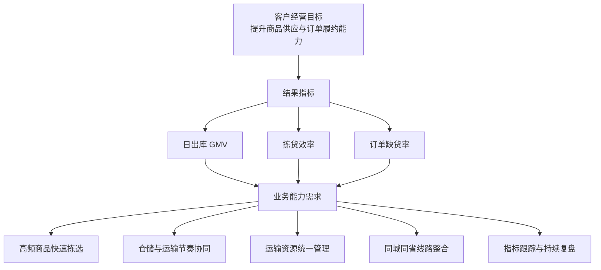
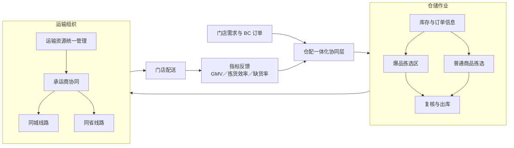

# 【供应链售前】L 客便利店 BC 仓配一体化非标解决方案

> 项目来源：京东物流行业解决方案实习经历
> 项目性质：真实项目经验的脱敏复盘
> 我的定位：解决方案参与者、跨团队协同与落地支持
> 数据边界：仅使用简历已披露指标，不展示客户全称、合同信息、仓网地址、费用或内部系统配置

## 一、项目概述

### 1. 项目背景

L 客是一家连锁便利店客户，业务覆盖同城及同省订单。随着业务规模增长，原有仓储、运输和承运资源之间的协同问题逐渐暴露，影响出库能力、拣货效率和商品满足率。

项目围绕“仓储作业优化、运输资源统一管理、同城同省线路整合”三个方向，设计并推动 BC 仓配一体化方案落地。

### 2. 客户痛点

| 痛点 | 业务表现 | 影响 |
|---|---|---|
| 仓储作业与订单结构匹配不足 | 爆品与普通商品采用相近的拣选组织方式 | 高频商品拣选路径较长，峰值订单处理能力受限 |
| 仓储与运输协同不足 | 出库节奏与车辆、线路安排缺少统一协调 | 可能产生等待、波峰拥堵或资源利用不均 |
| 承运资源分散 | 不同业务和线路分别管理运输资源 | 调度复杂，统一规划难度较高 |
| 同城与同省线路缺少整体规划 | 不同流向独立安排，线路存在整合空间 | 影响配送效率和资源利用 |
| 缺货率较高 | 项目基线订单缺货率为 53% | 影响门店补货、销售机会和客户体验 |
| 业务指标缺少统一闭环 | 仓、运、配分别关注局部指标 | 难以判断整体方案是否真正改善经营结果 |

### 3. 项目目标

- 优化爆品拣选区域，提高高频商品的拣选效率；
- 统一协调仓储、运输和承运商资源；
- 整合同城与同省线路，改善运输资源使用方式；
- 降低订单缺货率，提高商品满足能力；
- 提升日出库 GMV 和整体履约能力；
- 沉淀可复用于休食便利店场景的方案框架。

## 二、我的角色与职责

我作为行业解决方案团队成员参与项目方案建设和落地协同，主要工作包括：

1. 参与客户业务场景和问题梳理；
2. 将问题拆解为仓储、运输、承运资源和线路四类需求；
3. 参与爆品拣选区改造方案设计；
4. 协调仓储、运输及承运商相关资源；
5. 参与同城、同省线路整合方案推进；
6. 跟踪出库 GMV、拣货效率和订单缺货率等关键指标；
7. 对项目经验进行归纳，沉淀同类型便利店项目复制思路。

### 角色边界

- 我参与方案设计和实施协调，不将团队成果表述为个人独立完成；
- 仓库建设、运输执行和承运服务由对应专业团队共同完成；
- 本文展示的是公开求职版方法论，不披露企业内部报价、成本和系统信息。

## 三、需求拆解与分析

### 1. 从业务目标反推需求

### 2. 需求分层

| 层级 | 核心问题 | 对应需求 | 方案响应 |
|---|---|---|---|
| 经营层 | 如何提升门店供应与销售承接能力 | 提升出库规模、降低缺货 | 以 GMV、缺货率作为结果指标 |
| 运营层 | 如何提高仓内订单处理效率 | 优化爆品拣选方式 | 建设爆品拣选区，缩短高频商品作业路径 |
| 协同层 | 如何减少仓运之间的等待和割裂 | 统一仓储、运输和承运资源协同 | 建立仓运配协同机制 |
| 网络层 | 如何改善线路和运力组织 | 统筹同城、同省线路 | 合并可整合流向，统一规划运输资源 |
| 管理层 | 如何判断方案是否有效 | 建立指标基线与复盘机制 | 持续跟踪 GMV、效率、缺货率 |

### 3. 关键约束

- 方案需在既有业务连续运行的前提下推进；
- 仓储改造不能显著干扰正常出库；
- 线路整合需要兼顾配送时效与承运资源可用性；
- 业务结果受到商品供应、订单结构和运营执行等多因素影响；
- 各团队的管理边界不同，需要明确责任人和协同机制。

## 四、方案设计

### 1. 业务架构

### 2. 方案逻辑

1. 订单需求进入仓储环节；
2. 高频商品优先通过爆品拣选区组织作业；
3. 完成复核和出库后，进入统一的运输资源协调流程；
4. 按同城、同省流向组织线路；
5. 通过关键指标观察方案效果，并持续调整作业与资源配置。

### 3. 指标体系

| 指标 | 指标作用 | 项目基线／结果 |
|---|---|---|
| 日出库 GMV | 衡量仓配能力对业务规模的承接水平 | 由 60 万元提升至 90 万元以上 |
| 拣货效率 | 衡量仓内作业优化效果 | 提升 11% |
| 订单缺货率 | 衡量订单商品满足情况 | 由 53% 降至 7% |
| 线路执行情况 | 观察线路整合是否按方案运行 | 作为运营跟踪项，不披露内部数据 |
| 承运资源协同情况 | 观察资源统一管理效果 | 作为运营跟踪项，不披露内部数据 |

## 五、关键方案设计细节

### 1. 爆品拣选区设计

将高频、高贡献商品从普通拣选逻辑中识别出来，形成更适合其订单特征的作业区域。爆品范围应随订单结构动态复核；库位设计需要减少无效行走和重复搬运；改造应分阶段进行，避免影响正常出库。

### 2. 运输资源统一管理

将分散的运输与承运资源纳入统一协调视角，推动仓储出库计划、运力准备、线路安排和异常处理之间的信息对齐。

### 3. 同城与同省线路整合

以订单流向和配送要求为基础，在满足时效要求的前提下寻找线路整合空间，并通过实际运行持续复盘，而非一次性固化。

### 4. 仓运配协同机制

| 协同环节 | 需要对齐的信息 | 输出 |
|---|---|---|
| 订单进入 | 订单量、商品结构、流向 | 作业需求判断 |
| 仓内作业 | 拣选进度、预计出库节奏 | 运输准备依据 |
| 运力组织 | 可用资源、线路和承运安排 | 车辆与线路计划 |
| 配送执行 | 发运状态、异常信息 | 履约状态 |
| 运营复盘 | GMV、效率、缺货率 | 优化动作清单 |

## 六、落地执行与关键动作

1. 将客户问题拆解为仓内效率、库存满足、运输资源和线路组织等模块；
2. 协调仓储、运输及承运商资源，明确输入、输出和责任边界；
3. 配合仓储团队推进爆品拣选区域优化；
4. 推动运输资源统一管理；
5. 参与同城、同省线路整合；
6. 跟踪日出库 GMV、拣货效率和订单缺货率；
7. 归纳同类便利店项目的“问题—方案—动作—指标”框架。

## 七、业务结果与量化指标

| 业务指标 | 优化前 | 优化后 | 变化 |
|---|---:|---:|---:|
| 日出库 GMV | 60 万元 | 90 万元以上 | 提升至少 50% |
| 拣货效率 | 项目基线 | 基线的 111% | 提升 11% |
| 订单缺货率 | 53% | 7% | 下降 46 个百分点 |

项目同时沉淀了休食便利店同类型项目的复制模式。

> 业务结果由方案设计、运营执行、资源投入及客户业务变化共同形成，本文不将全部结果简单归因于单一动作。

## 八、复盘与思考

### 1. 项目难点

- **局部最优不等于整体最优：** 单独提升拣货速度，不一定能够解决缺货或运输衔接问题；
- **非标方案依赖跨团队协同：** 方案可行不代表能够自然落地，需要明确责任边界和协作机制；
- **业务指标存在多重影响因素：** 复盘时应区分直接影响、间接影响和外部变量。

### 2. 主要风险

| 风险 | 可能影响 | 应对思路 |
|---|---|---|
| 改造期间影响正常出库 | 业务波动 | 分阶段实施，避开业务高峰 |
| 爆品清单更新不及时 | 区域失效 | 建立定期复核机制 |
| 仓运节奏不一致 | 等待或拥堵 | 建立计划同步和异常沟通机制 |
| 线路整合过度 | 时效受影响 | 将履约要求作为线路整合前提 |
| 指标口径不一致 | 无法客观评价 | 在项目启动阶段统一定义和基线 |

### 3. 后续优化点

- 建立更稳定的商品分层与爆品动态调整机制；
- 进一步打通订单、仓储和运输数据视角；
- 将项目经验沉淀为行业诊断清单和标准方案组件；
- 建立项目复制前的适用性评估，避免机械套用；
- 将方案指标与 SOW、验收和运营复盘形成完整追踪链路。

## 九、交付产出清单

| 产出物 | 主要内容 |
|---|---|
| 客户问题清单 | 业务问题、影响和优先级 |
| 仓配一体化方案 | 仓储、运输、承运和线路方案 |
| 业务架构图 | 仓运配协同关系 |
| 指标跟踪表 | GMV、拣货效率、缺货率 |
| 实施动作清单 | 改造、资源协调、线路整合 |
| 风险清单 | 风险、影响和应对措施 |
| 项目复盘材料 | 结果、难点和复制建议 |
| SOW 要点 | 工作范围、交付物、验收和变更 |
