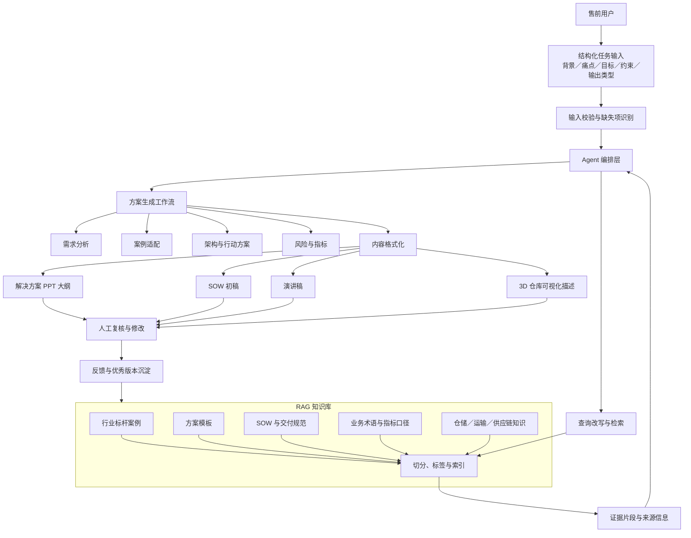
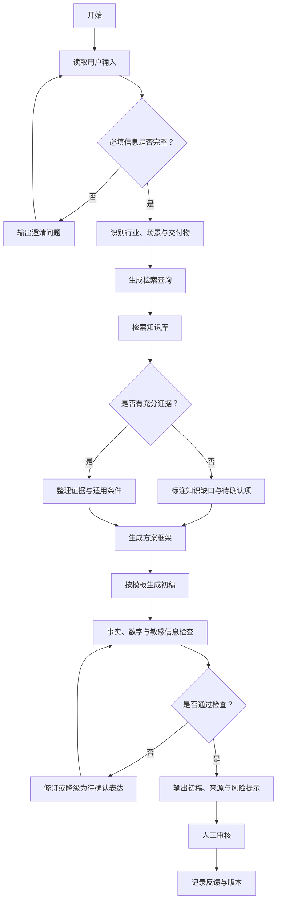

# 【AI 产品】面向售前场景的 Hermes 类 Agent 智能方案生成中台

> 项目来源：京东物流行业解决方案实习经历
> 项目性质：基于内部平台落地的 AI 应用，公开版本已脱敏
> 我的定位：Agent 提示词 SOP、行业案例 RAG 知识库和方案生成工作流配置
> 已披露结果：投入使用人数 50+
> 边界说明：本文展示产品方法和抽象架构，不披露内部接口、模型配置、案例原文或权限信息

## 一、项目概述

### 1. 项目背景

行业解决方案工作需要反复完成案例检索、业务分析、方案编写、SOW 整理、汇报材料和演讲稿准备。这类工作既依赖历史案例，又必须针对新客户的具体场景进行定制，无法直接复制旧材料。

为提高售前方案生产效率，我基于内部平台落地 Hermes 类 Agent 应用，配置 Agent 提示词 SOP、行业案例 RAG 知识库和方案生成工作流，并通过多轮测试持续调优。

### 2. 用户与使用场景

| 用户类型 | 核心任务 | 典型痛点 |
|---|---|---|
| 行业解决方案人员 | 检索案例、设计方案、编写材料 | 查找资料耗时，内容分散，重复编写较多 |
| 售前项目成员 | 快速形成项目初稿 | 输入信息不完整，方案结构容易遗漏 |
| 业务专家／审核者 | 复核业务逻辑与事实 | AI 输出来源不清，数字和结论需要核验 |
| 团队管理者 | 推动经验复用和标准化 | 优质案例沉淀后仍难以快速复用 |

> 上述痛点是对售前场景的产品化抽象，不代表披露企业内部具体管理问题。

### 3. 产品目标

- 通过结构化输入描述客户和业务问题；
- 从行业案例知识库检索可参考的方案证据；
- 根据任务生成 PPT 大纲、SOW、演讲稿等内容；
- 支持 3D 可视化仓库相关内容的标准化生成；
- 将事实、推断和待确认项分开表达；
- 保留人工审核环节，降低幻觉和错误引用风险；
- 通过反馈持续优化提示词、知识库和工作流。

### 4. 产品边界

该产品定位为“售前方案辅助工具”，而不是自动替代售前人员：

- AI 负责信息整理、案例检索、结构生成和初稿编写；
- 业务人员负责客户判断、数据确认、方案取舍和最终审批；
- 合同承诺、报价、法律条款及敏感数据不得由 AI 自动决定。

## 二、我的角色与职责

1. 梳理售前方案生成场景及任务类型；
2. 设计 Agent 的角色、能力边界和输出规则；
3. 编写并迭代 Agent 提示词 SOP；
4. 规划行业案例 RAG 知识库的内容结构；
5. 配置方案生成工作流；
6. 设计标杆案例检索和多类型内容生成路径；
7. 对输出进行多轮测试，识别事实性、完整性和格式问题；
8. 根据测试结果调整提示词、知识组织和节点逻辑；
9. 支撑应用投入团队使用。

## 三、需求拆解与分析

### 1. 用户任务链

### 2. 产品需求分层

| 层级 | 产品需求 | 设计响应 |
|---|---|---|
| 输入层 | 不同用户输入质量差异较大 | 使用结构化输入模板和缺失项检查 |
| 检索层 | 需要从历史案例中找到相关内容 | 建设行业案例 RAG 知识库 |
| 推理层 | 不能机械复制案例 | 要求 Agent 判断适用条件并标注推断 |
| 生成层 | 输出物类型多、格式不同 | 按 PPT、SOW、演讲稿等任务使用不同模板 |
| 风控层 | 可能产生幻觉或错误数字 | 证据引用、禁止编造、人工复核 |
| 运营层 | 产品需要持续优化 | 建立测试集、反馈记录和版本管理 |

### 3. 核心用户故事

- 作为售前人员，我希望输入客户背景后快速找到相似案例，以减少资料搜索时间；
- 作为方案人员，我希望系统按照固定结构生成初稿，以避免关键章节遗漏；
- 作为审核者，我希望看到内容依据和待确认项，以判断结论是否可靠；
- 作为团队管理者，我希望优秀案例能够被结构化复用，减少知识对个人经验的依赖。

## 四、方案设计

### 1. 产品架构

### 2. Agent 角色定义

**角色名称：** 售前解决方案生成助手

**核心职责：**

- 理解客户行业、场景、痛点、目标和约束；
- 检索与任务相关的案例和模板；
- 生成结构完整、可复核的方案初稿；
- 区分已知事实、合理推断和待确认项；
- 说明案例适用条件，不直接照搬；
- 信息不足时提出澄清问题；
- 按用户选择的交付物类型输出内容。

**禁止事项：**

- 不虚构客户信息、项目经历、财务数据或量化收益；
- 不自动生成未经确认的合同承诺；
- 不泄露其他客户或企业敏感信息；
- 不将相似案例结果直接承诺为当前项目结果；
- 不绕过人工审核直接对外发送方案。

## 五、关键产品设计细节

### 1. 结构化输入设计

| 字段 | 是否必填 | 说明 |
|---|---|---|
| 客户行业 | 是 | 如快消、3C、物流供应链 |
| 业务场景 | 是 | 仓储、运输、配送、仓网等 |
| 当前问题 | 是 | 客户明确提出的问题或现状 |
| 项目目标 | 是 | 希望改善的业务结果 |
| 已知数据 | 否 | 已确认的业务指标 |
| 约束条件 | 否 | 时间、资源、系统和合规限制 |
| 输出类型 | 是 | PPT 大纲、SOW、演讲稿等 |
| 输出受众 | 否 | 客户管理层、运营团队、技术团队 |
| 禁止披露内容 | 否 | 客户名称、价格、内部参数等 |

当必填信息不足时，Agent 优先输出“待澄清问题”，而不是直接生成完整方案。

### 2. RAG 知识库规划

| 知识域 | 内容 | 使用目的 |
|---|---|---|
| 行业案例库 | 脱敏后的项目背景、问题、方案、结果 | 案例检索与类比 |
| 业务能力库 | 仓储、运输、配送、仓网等能力说明 | 方案组件组合 |
| 模板库 | 解决方案、SOW、汇报材料结构 | 统一输出格式 |
| 指标库 | 指标定义、适用场景、计算口径 | 避免指标误用 |
| 风险库 | 常见风险、影响和应对措施 | 补充风险设计 |
| 术语库 | 行业缩写和标准表达 | 统一语言 |
| 合规规则库 | 脱敏、保密和输出边界 | 输出前检查 |

知识治理遵循入库前脱敏、结果与适用条件同时保存、过期材料标记、关键数字保留来源、知识变更留存版本及权限先于检索等原则。

### 3. 工作流设计

### 4. 人机协同设计

| 环节 | AI 负责 | 人员负责 |
|---|---|---|
| 信息输入 | 校验字段、识别缺失项 | 提供真实背景和约束 |
| 案例检索 | 召回和整理相关内容 | 判断案例是否适用 |
| 方案生成 | 生成结构和初稿 | 做业务取舍和定制 |
| 数字使用 | 标记来源和待确认项 | 核验数据与计算口径 |
| 风险控制 | 执行规则检查 | 审批对外内容 |
| 版本沉淀 | 整理反馈 | 确认是否可入库 |

## 六、落地执行与关键动作

1. 基于售前常见任务整理 Agent 使用场景；
2. 形成 Agent 系统提示词和任务提示词 SOP；
3. 整理并配置行业案例 RAG 知识库；
4. 将方案生成过程拆分为可编排的工作流节点；
5. 配置标杆案例检索、PPT、SOW、演讲稿和可视化内容生成路径；
6. 使用不同输入完整度和任务类型进行多轮测试；
7. 根据问题调整提示词约束、输出结构和知识召回方式；
8. 将应用投入实际团队使用；
9. 通过反馈持续迭代。

## 七、业务结果与效果衡量

### 1. 已披露结果

- 应用投入使用人数达到 **50+**；
- 实现标杆案例智能检索；
- 支持解决方案 PPT、SOW、演讲稿和 3D 可视化仓库内容的标准化生成；
- 提升了售前方案产出效率。

### 2. 建议持续跟踪的产品指标

| 指标类别 | 指标 | 评价目的 |
|---|---|---|
| 使用 | 活跃用户数、任务完成数、复用率 | 判断产品是否真正被使用 |
| 效率 | 初稿生成耗时、人工编辑耗时 | 判断是否减少重复劳动 |
| 质量 | 初稿采纳率、结构完整率 | 判断内容是否可用 |
| 检索 | 证据相关性、无结果率 | 判断知识库召回效果 |
| 事实性 | 无依据数字数、错误引用数 | 控制幻觉 |
| 安全 | 敏感信息拦截情况 | 控制泄密风险 |
| 满意度 | 用户反馈、推荐意愿 | 判断长期使用价值 |

以上为产品评价框架，不代表已经取得或公开披露的实测结果。

## 八、复盘与思考

### 1. 关键难点

- RAG 解决“找到什么”，但方案质量还取决于任务拆解、提示词结构和输出规则；
- 案例复用容易变成案例照搬，必须说明适用条件和差异；
- 格式正确不等于业务正确，客户判断和承诺风险仍需要人工审核；
- 知识入库、脱敏、标签、更新和失效管理都会影响最终效果。

### 2. 主要风险

| 风险 | 表现 | 控制措施 |
|---|---|---|
| 幻觉 | 编造事实、指标或能力 | 强制来源、待确认标记、人工审核 |
| 错误类比 | 将其他项目结果直接套用 | 输出适用条件和差异项 |
| 知识过期 | 召回旧版本方案 | 状态与版本管理 |
| 信息泄露 | 输出敏感客户内容 | 入库脱敏、权限控制、输出检查 |
| 输入不足 | 生成看似完整但不可用的方案 | 先提问再生成 |
| 用户过度依赖 | 未复核即对外使用 | 明确工具定位和审批节点 |

### 3. 后续优化方向

- 建立固定测试集，持续评估提示词和检索效果；
- 建立案例质量评分与失效机制；
- 增加输出证据映射，让关键结论可追溯；
- 根据任务类型采用不同检索和生成策略；
- 建立用户反馈标签，区分事实错误、结构问题和表达问题；
- 对高风险任务设置更严格的人工审批门槛。

## 九、交付产出清单

| 产出物 | 内容 |
|---|---|
| Agent 角色说明 | 目标、能力、边界和禁止事项 |
| 系统提示词 | 事实约束、工作步骤、输出规范 |
| Prompt SOP | 输入方法、任务模板和迭代规则 |
| RAG 知识库方案 | 分类、元数据、脱敏、版本和更新机制 |
| 工作流配置 | 输入校验、检索、生成、检查和审核节点 |
| 解决方案模板 | PPT 大纲和客户方案结构 |
| SOW 模板 | 范围、交付物、验收和变更结构 |
| 演讲稿模板 | 逐页讲解、重点和问答提示 |
| 3D 仓库内容模板 | 场景描述和参数输入结构 |
| 测试记录 | 测试输入、问题分类、修改方案和版本 |
| 产品指标框架 | 使用、效率、质量、事实性和安全指标 |

完整提示词与工作流样例见：[`docs/Agent提示词SOP样例.md`](../docs/Agent提示词SOP样例.md)。
