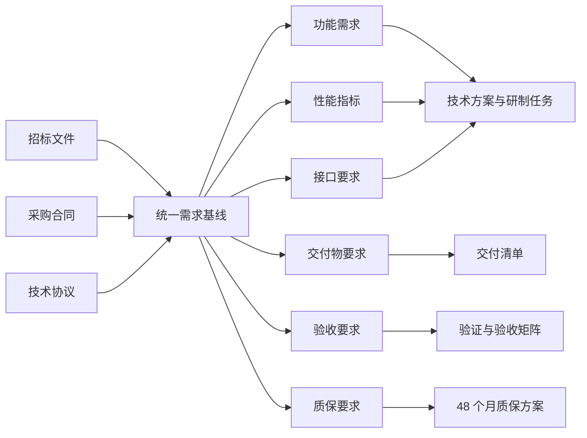
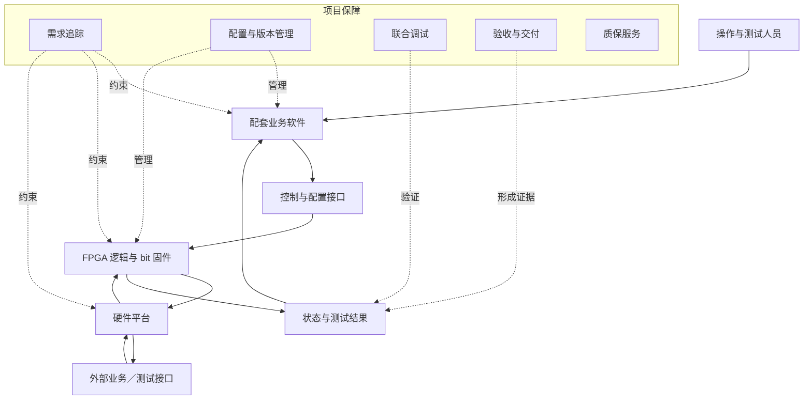
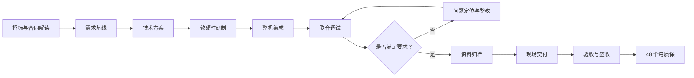

# 【军工通信售前】业务模拟测试分系统投标与交付全套方案

> 项目来源：某研究所业务模拟测试分系统项目
> 项目周期：2024.09—2025.01
> 我的角色：学生侧负责人
> 项目性质：真实项目经验的公开脱敏复盘
> 保密边界：不披露采购方全称、设备型号、技术指标数值、接口参数、部署位置和测试数据

## 一、项目概述

### 1. 项目背景

项目需根据招标文件、采购合同和技术协议，完成某业务模拟测试分系统的方案设计、软硬件研制、整机集成、现场交付和质保安排。

项目既包含售前阶段的需求解读、技术方案和投标支撑，也包含履约阶段的硬件选型、FPGA 逻辑开发、配套业务软件调试、联合测试和交付资料编制。

### 2. 项目特点

- 需求来源包括招标文件、采购合同和技术协议；
- 技术指标与验收要求必须准确对应；
- 涉及硬件、FPGA 固件、配套业务软件和整机集成；
- 需要控制项目范围，避免外协交付风险；
- 交付物包括设备和完整随货资料；
- 需要设计覆盖 48 个月的质保服务方案。

### 3. 项目目标

- 将招标和合同要求转化为可执行的系统方案；
- 明确系统范围、模块组成、接口和验收映射；
- 完成硬件选型、整机装配、FPGA 逻辑及业务软件调试；
- 通过联合调试验证系统指标；
- 形成完整、可核验的交付资料；
- 完成现场交付、表面验收和签收配合；
- 建立 48 个月质保期内的服务和返修规则。

## 二、我的角色与职责

作为学生侧负责人，我承担或统筹以下工作：

1. 解读招标文件和采购合同；
2. 梳理系统指标、交付范围和验收要求；
3. 制定整体技术方案；
4. 管控项目范围，识别外协交付风险；
5. 统筹硬件选型和整机装配；
6. 统筹 FPGA 逻辑开发并生成 bit 固件；
7. 调试配套业务软件；
8. 组织整机联合调试；
9. 编制随货交付资料；
10. 协调现场交付和签收；
11. 编制 48 个月质保服务方案。

## 三、需求拆解与分析

### 1. 需求来源

### 2. 需求追踪方法

| 追踪字段 | 说明 |
|---|---|
| 需求编号 | 对要求进行唯一标识 |
| 来源 | 招标文件、合同或技术协议 |
| 需求描述 | 保留可验证的要求表达 |
| 所属模块 | 硬件、FPGA、软件、整机或文档 |
| 设计响应 | 说明方案如何满足要求 |
| 验证方式 | 检查、测试、演示或文档审查 |
| 交付证据 | 设备、固件、记录或技术文档 |
| 状态 | 待确认、设计中、已实现、已验证 |

### 3. 需求分类

| 分类 | 主要内容 | 关注重点 |
|---|---|---|
| 功能需求 | 系统需要完成的业务模拟与测试能力 | 功能边界和异常处理 |
| 性能指标 | 技术协议规定的性能要求 | 测试方法和判定依据 |
| 硬件需求 | 设备选型、装配和连接 | 兼容性、可采购性和交付风险 |
| FPGA 需求 | 逻辑功能和 bit 固件 | 版本、烧录和验证 |
| 软件需求 | 配套业务软件功能 | 参数配置、控制和结果反馈 |
| 接口需求 | 模块之间的交互 | 输入输出、时序和异常 |
| 交付需求 | 设备、固件及随货资料 | 完整性和版本一致性 |
| 服务需求 | 质保、故障响应和返修 | 责任边界和流程 |

## 四、方案设计

### 1. 系统总体架构

> 架构仅展示公开层面的模块关系，不代表真实系统拓扑和接口细节。

### 2. 模块化设计

| 模块 | 主要职责 | 交付形态 |
|---|---|---|
| 硬件平台 | 承载系统运行和外部连接 | 整机设备 |
| FPGA 逻辑 | 实现技术协议要求的逻辑功能 | bit 固件及版本说明 |
| 配套业务软件 | 完成业务配置、控制和结果显示 | 软件及操作说明 |
| 接口适配 | 完成模块之间的信息交互 | 接口说明和测试记录 |
| 集成测试 | 验证模块组合后的功能和指标 | 联调记录与问题闭环 |
| 交付保障 | 组织资料、验收和签收 | 随货资料与交付记录 |
| 质保服务 | 规范故障响应和返修 | 48 个月质保方案 |

### 3. 售前到交付的闭环

## 五、关键方案设计细节

### 1. 招标文件与合同解读

解读时同步识别功能、技术指标、验收判据、交付物、协同要求、质保责任、范围外事项及可能产生歧义的条款。无法仅凭文件确定的内容形成澄清项，不自行假设。

### 2. 范围管理

- 基线内需求进入设计、实现和验证；
- 新增需求先分析对硬件、固件、软件、进度和交付的影响；
- 未经确认的新增事项不直接纳入承诺；
- 外协任务明确输入、输出、版本和验收责任；
- 交付前核对设备、固件、软件和文档版本一致性。

### 3. 软硬件协同

硬件、FPGA 和业务软件围绕统一接口和测试场景进行联合验证，重点检查选型与协议的符合性、逻辑与硬件资源匹配、固件版本可追踪、软件与底层配置一致及边界条件处理。

### 4. 验收设计

| 验收对象 | 验证方式 | 证据 |
|---|---|---|
| 整机外观与数量 | 表面检查、清点 | 签收或检查记录 |
| 功能要求 | 操作演示或测试 | 测试记录 |
| 性能指标 | 按技术协议规定方法验证 | 指标测试结果 |
| FPGA 固件 | 版本核对和功能验证 | 固件版本说明 |
| 配套软件 | 功能操作与结果检查 | 软件测试记录 |
| 随货资料 | 清单核对 | 文档签收记录 |

## 六、落地执行与关键动作

1. 解读招标文件、采购合同和技术协议；
2. 形成系统需求和验收要求清单；
3. 制定总体方案并明确系统边界；
4. 统筹硬件选型和整机装配；
5. 推进 FPGA 逻辑开发并生成 bit 固件；
6. 调试配套业务软件；
7. 组织软硬件整机联合调试；
8. 对不符合项进行定位和整改；
9. 编制生产合格证、使用说明书、质量保证书、保修单、固件和技术设计文档；
10. 统筹现场交付，配合完成货物表面验收与签收；
11. 编制覆盖 48 个月的质保服务方案。

## 七、业务结果与量化指标

由于公开材料不披露具体技术指标和合同金额，本项目不虚构量化性能数据。

已完成的结果包括：

- 完成招标和合同要求解读及整体技术方案设计；
- 完成硬件选型、整机装配、FPGA 逻辑和 bit 固件相关工作；
- 完成配套业务软件调试和整机联合调试；
- 形成完整随货交付资料；
- 配合完成现场交付、货物表面验收和签收；
- 形成 **48 个月质保服务方案**。

## 八、复盘与思考

### 1. 项目难点

- 招标文件、合同和技术协议的表达层级不同，需要建立统一需求基线；
- 技术方案不仅要描述“支持什么”，还要说明“如何验证”；
- 设备、固件、软件和文档必须保持版本一致；
- 随货资料是合同履约的重要组成部分，而非附属工作。

### 2. 主要风险

| 风险 | 影响 | 应对策略 |
|---|---|---|
| 文件要求冲突 | 设计依据不一致 | 建立统一需求基线并发起澄清 |
| 技术范围不断扩大 | 进度和成本失控 | 明确范围并执行变更管理 |
| 外协边界不清 | 交付责任缺失 | 明确输入、输出、验收和责任人 |
| 固件版本错误 | 现场功能异常 | 建立版本标识和交付核对 |
| 联调问题发现过晚 | 影响现场交付 | 提前开展分模块和整机验证 |
| 文档不完整 | 无法完成交付核验 | 使用交付清单逐项检查 |
| 质保规则模糊 | 后续争议 | 明确响应、返修和责任边界 |

### 3. 后续优化点

- 将需求追踪矩阵前置到投标阶段；
- 为软硬件版本建立统一配置清单；
- 将测试用例与验收条款直接关联；
- 对外协任务使用明确的输入输出验收表；
- 在现场交付前执行预验收检查；
- 建立质保期问题台账，保留版本和处理记录。

## 九、交付产出清单

| 阶段 | 产出物 |
|---|---|
| 投标与方案 | 技术方案、需求清单、需求响应矩阵 |
| 设计 | 系统总体设计、模块设计、接口说明 |
| 研制 | 整机设备、FPGA 逻辑、bit 固件、配套业务软件 |
| 测试 | 联调记录、问题清单、整改记录、测试结果 |
| 随货资料 | 生产合格证、使用说明书、质量保证书、保修单 |
| 技术资料 | 固件、技术设计文档、版本说明 |
| 交付 | 交付清单、表面验收与签收配合材料 |
| 服务 | 48 个月质保服务方案 |

技术标片段示例见：[`docs/招投标技术方案片段样例.md`](../docs/招投标技术方案片段样例.md)。
