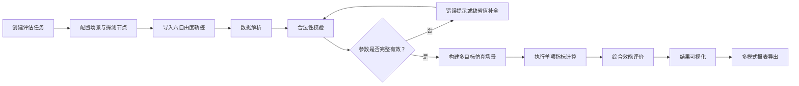
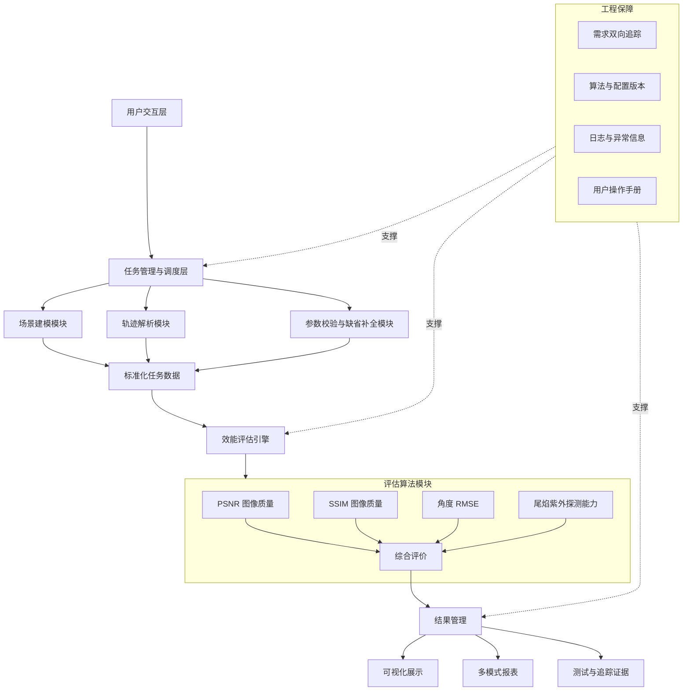

# 【军工 AI + 仿真】探测效能评估系统产品设计

> 项目来源：某军队项目
> 项目周期：2026.05—至今
> 我的角色：软件开发与技术文档撰写
> 方向定位：AI 产品思维 + 仿真评估技术方案
> 保密边界：不披露装备型号、探测参数、场景坐标、部署方式、数据样本和实际评估结果

## 一、项目概述

### 1. 项目背景

项目面向探测效能评估场景，需要将探测节点参数、六自由度轨迹数据、图像质量、角度精度和尾焰紫外探测能力等信息纳入统一的软件评估流程。

系统支持场景与节点参数配置、六自由度轨迹解析、参数合法性校验、缺省值补全、多目标仿真、PSNR／SSIM／RMSE 等指标计算、尾焰紫外探测能力计算、综合效能评价、结果可视化和多模式报表导出。

### 2. 项目定位

本文中的“AI 产品”侧重将复杂专业任务设计为可使用的软件产品，将专家评价方法转化为可配置的计算流程，并用数据处理、综合评价和可视化辅助决策。本文不将传统指标计算描述为机器学习模型，也不虚构模型训练或预测准确率。

### 3. 用户与痛点

| 用户 | 核心任务 | 痛点 |
|---|---|---|
| 场景配置人员 | 配置节点、目标和轨迹 | 参数多，输入错误会影响后续计算 |
| 算法与评估人员 | 运行指标计算和综合评价 | 指标分散，过程难以统一管理 |
| 测试与专家用户 | 检查功能和结果 | 需要可追溯、可复核的计算过程 |
| 项目管理与交付人员 | 跟踪需求和生成材料 | 需求、功能、测试和文档需要一致 |

## 二、我的角色与职责

1. 参与系统总体设计和模块化任务驱动架构设计；
2. 定义模块间接口和数据流转规则；
3. 完成场景建模、节点参数配置和六自由度轨迹解析；
4. 实现参数合法性校验和缺省值补全；
5. 实现 PSNR、SSIM、角度 RMSE 和尾焰紫外探测能力计算；
6. 基于综合评价方法量化图像参数带来的系统探测效能增量；
7. 完成结果可视化和多模式报表导出；
8. 落实需求双向追踪并配合专家测试；
9. 编写软件用户操作手册等技术文档。

## 三、需求拆解与分析

### 1. 产品任务链

### 2. 功能需求

| 模块 | 功能需求 | 关键设计点 |
|---|---|---|
| 任务管理 | 创建和执行评估任务 | 任务状态、输入和结果关联 |
| 场景建模 | 配置节点和目标 | 参数结构统一 |
| 轨迹解析 | 读取六自由度轨迹数据 | 格式识别、字段映射、异常处理 |
| 参数校验 | 检查范围、类型和完整性 | 错误定位与可解释提示 |
| 缺省补全 | 对允许缺失的字段使用缺省值 | 明确标记补全字段 |
| 指标计算 | 计算图像质量、角度精度和探测能力 | 算法输入输出一致 |
| 综合评价 | 汇总多项指标 | 权重与归一化方法可追溯 |
| 可视化 | 展示评估结果 | 支持理解和对比 |
| 报表 | 导出不同使用场景的结果 | 模板和数据来源一致 |
| 追踪与测试 | 关联需求、实现和验证 | 支持专家测试和交付 |

### 3. 非功能需求

- 模块之间使用明确接口传递数据；
- 输入异常不得导致无提示的错误结果；
- 缺省值补全需要可追踪；
- 评估结果需要能够复核；
- 算法版本、输入数据和输出结果需要关联；
- 报表中的数字应与系统结果一致；
- 系统公开材料不得包含涉密参数。

## 四、方案设计

### 1. 系统架构

### 2. 模块边界

| 模块 | 输入 | 输出 | 责任边界 |
|---|---|---|---|
| 场景建模 | 节点、目标及场景参数 | 场景对象 | 不执行指标计算 |
| 轨迹解析 | 六自由度轨迹文件 | 标准轨迹数据 | 不修改原始数据含义 |
| 参数校验 | 场景、轨迹和算法参数 | 校验结果 | 不静默忽略非法输入 |
| 缺省补全 | 允许缺失的参数 | 补全后的参数与标记 | 仅补全规则允许的字段 |
| 评估引擎 | 标准任务数据 | 单项和综合结果 | 不负责用户界面 |
| 可视化 | 评估结果 | 图表和对比视图 | 不改变计算结果 |
| 报表 | 任务信息和结果 | 导出文件 | 与系统内结果保持一致 |

## 五、关键产品与技术设计细节

### 1. 六自由度轨迹解析

轨迹解析关注数据字段映射、时间序列顺序、位置与姿态数据读取、数据类型与格式校验，以及缺失、重复和异常记录识别。无法安全补全的关键字段应阻止任务进入计算阶段并提示具体问题。

### 2. 参数合法性校验与缺省补全

参数校验分为结构校验、规则校验和关联校验。缺省补全遵循“可见、可追踪、可覆盖”原则，仅对规则允许的非关键参数补全，并在界面和报表中标记来源。

### 3. 评估指标设计

#### PSNR

PSNR 用于衡量图像与参考图像之间的质量差异：

$$
\mathrm{PSNR}=10\log_{10}\left(\frac{MAX^2}{MSE}\right)
$$

#### SSIM

SSIM 从亮度、对比度和结构等角度评价图像相似性。系统应保证输入图像尺寸、数据范围和预处理口径一致。

#### 角度 RMSE

$$
RMSE=\sqrt{\frac{1}{n}\sum_{i=1}^{n}(\hat{\theta_i}-\theta_i)^2}
$$

角度数据需要关注单位统一、周期边界和异常值处理。

#### 尾焰紫外探测能力

根据项目规定的输入参数和计算方法实现能力评估。公开作品集不展示具体公式、阈值和参数。

### 4. 综合评价

综合评价包括指标方向统一、归一化、权重配置、缺失值处理、综合得分计算和结果解释。抽象表达为：

$$
S=\sum_{i=1}^{n}w_i \cdot N(x_i)
$$

其中权重和评价规则以项目确认内容为准。

### 5. 产品交互设计

- **创建任务：** 选择场景、节点、目标、轨迹、指标和输出模式；
- **校验确认：** 展示通过项、非法参数、缺失参数和已使用缺省值；
- **结果查看：** 区分单项指标、综合结果、对象对比、异常提示和报表导出。

## 六、落地执行与关键动作

1. 参与总体架构和模块接口设计；
2. 将评估任务拆分为场景、解析、校验、算法、展示和报表模块；
3. 实现场景与节点参数配置及六自由度轨迹数据解析；
4. 实现参数合法性校验和缺省值补全；
5. 实现 PSNR、SSIM、角度 RMSE 和尾焰紫外探测能力计算；
6. 接入综合评价方法；
7. 完成结果可视化和多模式报表导出；
8. 建立需求、设计、实现和测试之间的追踪关系；
9. 配合专家测试并闭环问题；
10. 编写软件用户操作手册等技术文档。

## 七、业务结果与量化指标

由于项目公开信息不包含具体性能目标和测试结果，本文不虚构准确率、性能提升比例或专家评分。

已实现或完成的能力包括：场景与节点参数配置、六自由度轨迹解析、参数校验、缺省值补全、多目标仿真、PSNR／SSIM／角度 RMSE／尾焰紫外探测能力计算、综合效能评价、结果可视化、多模式报表、需求双向追踪、专家测试配合及用户手册编制。

### 建议持续跟踪的产品指标

| 指标 | 评价目的 |
|---|---|
| 任务配置成功率 | 判断场景配置是否易用 |
| 参数错误定位率 | 判断校验信息是否有效 |
| 缺省值使用可追踪率 | 防止补全过程不可见 |
| 算法测试通过情况 | 验证实现是否符合设计 |
| 需求覆盖情况 | 检查需求是否完成设计、实现和验证闭环 |
| 报表一致性 | 确保导出结果与系统结果一致 |
| 专家问题闭环情况 | 跟踪测试反馈处理 |

以上为建议评价维度，不代表已经披露的实测值。

## 八、复盘与思考

### 1. 项目难点

- 算法正确只是基础，用户还需要明确输入、校验、状态、结果解释和报表；
- 轨迹或参数错误可能造成结果偏差，校验与补全必须作为独立模块；
- 综合评价的权重、归一化和指标方向必须可解释；
- 专家测试问题需要追溯到对应需求、模块、算法和版本。

### 2. 主要风险

| 风险 | 影响 | 应对措施 |
|---|---|---|
| 轨迹格式异常 | 无法建模或计算错误 | 解析前检查并输出明确错误 |
| 参数单位不一致 | 结果失真 | 统一单位并在接口层校验 |
| 缺省值被误认为真实输入 | 结论误判 | 显式标记补全字段 |
| 算法口径不一致 | 结果不可比较 | 固化版本和输入输出说明 |
| 综合权重缺少依据 | 结果解释困难 | 保留配置来源并支持复核 |
| 报表与系统结果不一致 | 交付风险 | 使用统一结果源生成报表 |
| 涉密信息外泄 | 合规风险 | 分级、脱敏和权限控制 |

### 3. 后续优化方向

- 增强批量任务和场景对比能力；
- 建立算法版本与结果版本的关联；
- 增加参数变更对结果影响的敏感性分析；
- 改善错误信息和操作引导；
- 建立更加系统的专家测试案例库；
- 在数据和合规条件允许时，探索智能参数检查与结果解释能力。

## 九、交付产出清单

| 类型 | 产出物 |
|---|---|
| 产品设计 | 用户任务流、功能拆解、模块边界 |
| 系统设计 | 总体架构、模块接口、数据流规则 |
| 场景功能 | 节点配置、轨迹解析、参数校验和缺省补全 |
| 算法功能 | PSNR、SSIM、角度 RMSE、紫外探测能力和综合评价 |
| 展示功能 | 结果可视化、多模式报表 |
| 测试材料 | 需求追踪、测试记录、问题闭环 |
| 技术文档 | 设计说明、接口说明、用户操作手册 |
